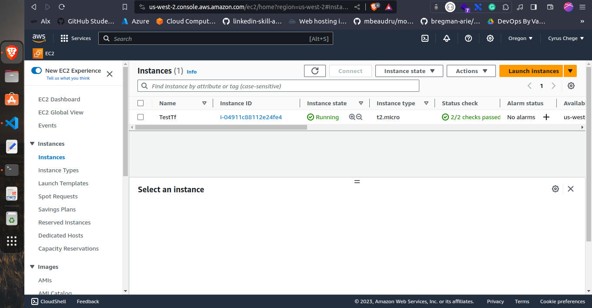
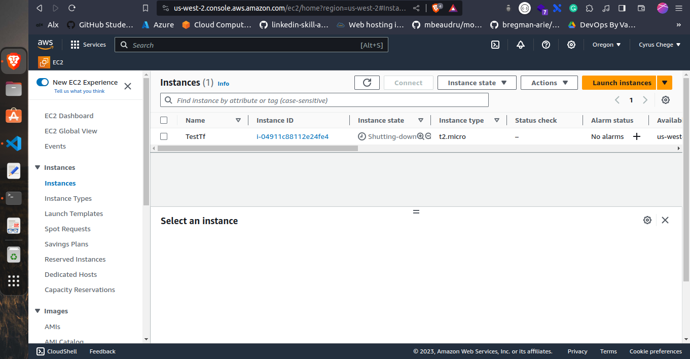

# Terraform

## What is Terraform?

Terraform is an open-source infrastructure as code(IAC) tool that lets you define both cloud and on-prem resources in human-readable configuration files that you can version, reuse, and share. 
This includes low-level components like compute instances, storage, and networking; and high-level components like DNS entries and SaaS features.

## How does Terraform work?
Terraform creates and manages resources on cloud platforms and other services through their application programming interfaces (APIs). 
 Providers enable Terraform to interact with virtually any cloud service, platform, or device that exposes an API.

 #### Terraform Workflow

 **Write** - Author infrastructure as code.
    Defining resources in configuration files. 
    (Write .tf files, using HCL(HashiCorp Configuration Language), and run `terraform init` to initialize the working directory.)

**Plan** - Preview changes before applying.
    Terraform creates an execution plan describing the infrastructure it will create, update, or destroy based on the existing infrastructure and your configuration. (Run `terraform plan` to create an execution plan.)

 **Apply** - Provision reproducible infrastructure.
    Terraform builds infrastructure. It first reads the current state of the real-world infrastructure, then generates a plan for creating, updating, or destroying resources as needed. (Run `terraform apply` to execute the plan.)

**Destroy** - Change infrastructure safely and efficiently.
Unwind all the changes Terraform has made to infrastructure, and remove all the resources it created. (Run `terraform destroy` to destroy all the resources created by Terraform.)

## Why Terraform?

- **Multi-Cloud Infrastructure** - Terraform is cloud-agnostic and can be used to provision infrastructure across multiple public cloud providers, including Amazon Web Services, Google Cloud Platform, Microsoft Azure, IBM Cloud, and Oracle Cloud Infrastructure.

- **Stateful** - Terraform uses a state file to keep track of the resources it manages. This allows Terraform to know what changes need to be made to bring the actual state of the infrastructure in line with the desired state defined by the configuration files.
- **Versioned** - Terraform configuration files are human-readable and can be shared, reused, and modified. They can also be stored in version control systems such as Git, which allows you to track changes over time.
- **Declarative** - Terraform configuration files are declarative, meaning that you define the desired state of the infrastructure in configuration files. 

# Installation

## Install Terraform on Linux
```
wget -O- https://apt.releases.hashicorp.com/gpg | sudo gpg --dearmor -o /usr/share/keyrings/hashicorp-archive-keyring.gpg
echo "deb [signed-by=/usr/share/keyrings/hashicorp-archive-keyring.gpg] https://apt.releases.hashicorp.com $(lsb_release -cs) main" | sudo tee /etc/apt/sources.list.d/hashicorp.list
sudo apt update && sudo apt install terraform
```

For more information and other OS installation, visit [here](https://developer.hashicorp.com/terraform/downloads)

# Examples

Ensure you have the following:

- AWS account
- AWS CLI

    configure your AWS CLI with your credentials

    ```
    aws configure
    ```
    Add your AWS Access Key ID and AWS Secret Access Key


- Terraform
    ```
    terraform --version
    ```
  This will show you the version of Terraform you have installed.

  - Make a directory for Terraform working directory
    ```
    mkdir terraform-aws
    cd terraform-aws
    ```
    - Create a file with the name `main.tf` and add the following code to it.

    [main.tf](https://github.com/CyrusNchege/AWS-devops-100-day-challenge/blob/main/Day-11-Terraform(IAC)/main.tf)


    - Run `terraform init` to initialize the working directory.

    - Run `terraform plan` to create an execution plan.

    - Run `terraform apply` to execute the plan.

    This will create an EC2 instance on AWS.
    

    - Run `terraform destroy` to destroy all the resources created by Terraform.

    

    
Congratulations! You have successfully created and destroyed an EC2 instance using Terraform.

# Conclusion

Terraform is a great tool for managing infrastructure as code. It is easy to use and can be used to provision infrastructure across multiple public cloud providers. It also has a lot of features that make it easy to manage infrastructure as code.

I will be writing more on Terraform and diffrent customizations that can be done with it.