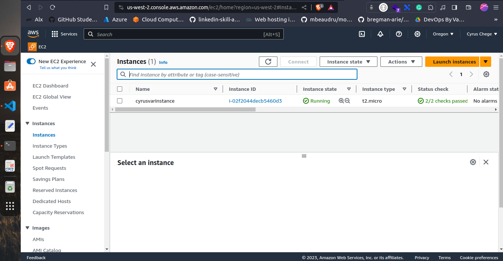
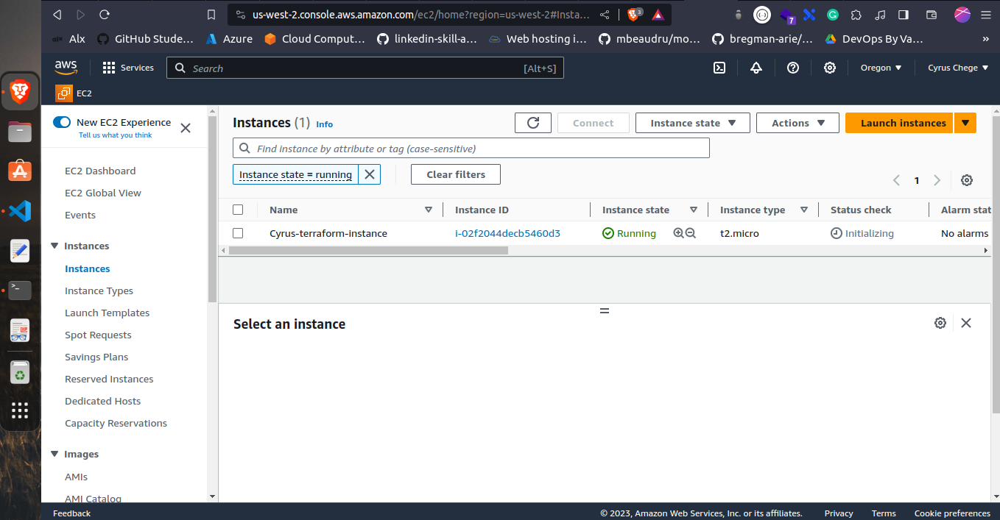

# Terraform (Continuation)

This is a continuation of the previous [Terraform](../Day-11-Terraform(IAC) ) challenge. 

For the last challenge, we created a simple Terraform file that created a single EC2 instance. In this challenge, we will be creating a more terraform file that will use variables.

## Why use variables?

Variables allows you to write terraform files that are flexible and reusable. 
For example, if you want to create instance with diffrent Instance name, you can use variables to do that.

## Creating a variable

In your terraform working directory, create a file called `variables.tf`. This file will contain all the variables that you will be using in your terraform file.

Note: You will require `main.tf` file from the previous challenge. 

In the `variables.tf` file, add the following code:

```hcl
variable "instance_name" {
    description = "Terraform instances name"
    type = string
    default = "Cyrus-terraform-instance"
}
```
Also included in this Day-12 folder.

## Using the variable

Now that you have created a variable, you can use it in your `main.tf` file.

In the `main.tf` file, add the following code:

```hcl
provider "aws" {
    region = "us-west-2"

}

resource "aws_instance" "TestTf" {
    ami = "ami-0f3769c8d8429942f"
    instance_type = "t2.micro"

    tags = {
        # Name = "Cyrus-terraform-instance"
        Name = var.instance_name
    }
}

```

Also included in this Day-12 folder.

In the above we have removed the hard coded instance name and replaced it with the variable `var.instance_name`.

## Applying the variables

Now that you have created a variable and used it in your `main.tf` file, you can now apply the changes.

Run the following command:

```bash
terraform init
```

```bash
terraform plan
```

```bash
terraform apply
```
This will create a new instance with the name `Cyrus-terraform-instance`, which is the default value of the variable.

[

## Changing the variable value

You can change the value of the variable by running the following command:

```bash
terraform apply -var="instance_name=New-instance-name"
```

You can change the name `New-instance-name` to whatever you want.
    
[

## Destroying the instance

If it is for testing purposes, you can destroy the instance by running the following command:

```bash 
terraform destroy
```

Congratulations! You have successfully created a variable and used it in your terraform file.

## Conclusion

In this challenge, you have learned how to create a variable and use it in your terraform file. You have also learned how to change the value of the variable.


